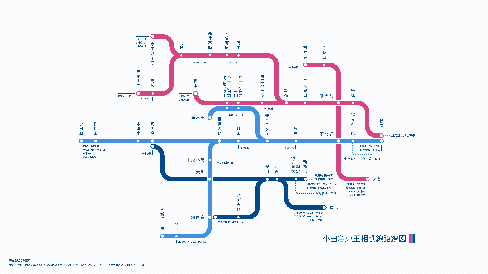

# Tokyo-Kanagawa 3-in-1 Railway Map

This is a combined railway map of three private railway companies that connect the central part of Tokyo and Kanagawa Prefecture. The following lines are included:

- Odakyu Line
- Keio Line
- Sotetsu Line

The map is designed to be displayed on a 4K monitor. It is also available in PDF format.
No English version is available at this time.

# 東京・神奈川 3 in 1 鉄道路線図

東京〜神奈川の県央部と都心を結ぶ私鉄3社の路線を1つにまとめた路線図です。以下の路線が含まれています。

- 小田急線
- 京王線
- 相鉄線

この路線図は4Kモニターに最適となるようにデザインされています。PDF形式でも利用可能です。

## Preview

